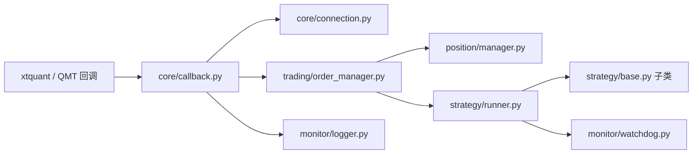
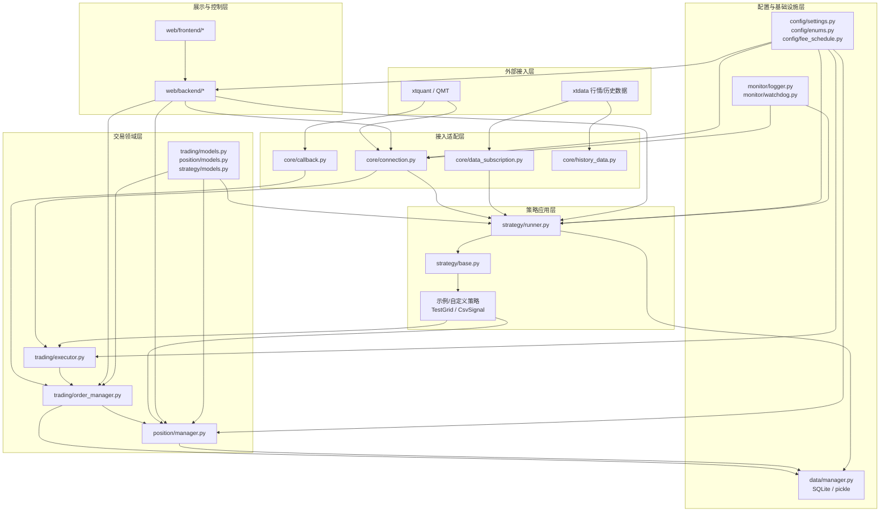
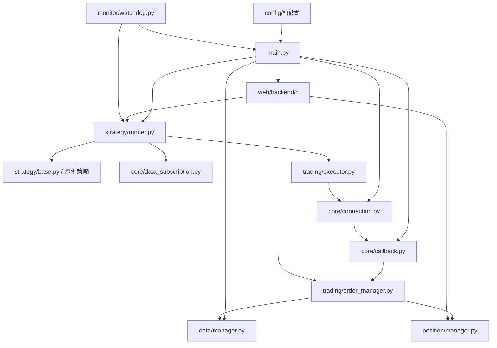
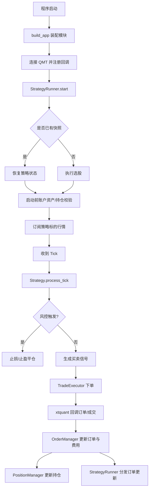

# cytrade

# 重要提示：第一版已实盘测试，开发完毕。第二版会有大更新，将异步编程全部修改为Async/Await范式，摒弃回调函数的方法。增加其他市场接入能力。


cytrade 是一个基于 [xtquant](https://dict.thinktrader.net/nativeApi/start_now.html) / QMT 的 Python 量化交易框架，覆盖以下完整链路：

- 交易连接与自动重连
- 实时行情订阅与分发
- 策略运行与状态恢复
- 订单追踪与成交回调
- 持仓管理与盈亏统计
- 手续费追踪与 T+0/T+1 可用仓位控制
- Watchdog 监控告警
- FastAPI + Vue Web 控制台
- 一个策略对象维护一个标的，实现标的管理解耦。
- 长期调度与日内交易会话完全分离，便于稳定运行与分层控制。
- 附加两个示例策略，帮助理解程序逻辑。

当前仓库适合以下用途：

- 作为个人量化交易框架骨架
- 作为 xtquant/QMT 集成示例
- 作为策略开发、回放验证、Web 控台集成的学习项目

> 安全说明：仓库默认不再包含任何真实账号、密码、令牌或本地客户端路径。运行前请自行配置本地环境。

---

## 特性

| 模块 | 能力 |
|---|---|
| 连接管理 | QMT 连接、断线重连、重连回调 |
| 数据订阅 | 个股订阅、全市场订阅、重连后恢复订阅 |
| 历史数据 | 批量下载、独立读取、多周期、复权、字段选择、缓存复用 |
| 交易日历 | 交易日判断、交易日偏移、交易日区间生成 |
| 交易执行 | 限价、市价、按金额下单、平仓、撤单 |
| 订单管理 | UUID 追踪、柜台单号映射、成交/状态更新 |
| 持仓管理 | 移动平均成本、FIFO、实时浮盈/实盈统计 |
| 费率管理 | 费率表匹配、佣金/印花税追踪、T+0/T+1 可用仓位 |
| 策略框架 | `BaseStrategy`、信号与交易分离、风控前置 |
| 策略运行 | 选股、行情分发、调度、快照恢复、停止归档、长期调度与日内会话分离 |
| 数据持久化 | SQLite、本地状态恢复、可选 PostgreSQL 同步 |
| 监控告警 | 心跳、连接状态、数据超时、CPU/内存、钉钉通知 |
| Web 控制台 | FastAPI REST、WebSocket、Vue 3 前端 |

---

## 界面截图

以下截图来自当前项目的 Web 控制台，图片已压缩后存放在 `docs/screenshots/`：

Web 控制台当前主要覆盖以下能力：

- 系统运行状态查看
- 策略列表与状态控制
- 持仓与盈亏明细查看
- 订单状态跟踪与撤单
- 成交记录与成交时间展示

<table>
    <tr>
        <td width="50%" align="center">
            <strong>首页 / 系统总览</strong><br/>
            
            <br/>
            展示系统状态、运行概览与主要监控信息。
        </td>
        <td width="50%" align="center">
            <strong>策略管理页面</strong><br/>
            
            <br/>
            查看策略状态，并执行暂停、恢复、平仓等操作。
        </td>
    </tr>
    <tr>
        <td width="50%" align="center">
            <strong>持仓页面</strong><br/>
            
            <br/>
            展示策略级持仓、可用数量、浮盈亏与手续费汇总。
        </td>
        <td width="50%" align="center">
            <strong>订单页面</strong><br/>
            
            <br/>
            查看订单状态流转、成交均价、费用与备注信息。
        </td>
    </tr>
    <tr>
        <td colspan="2" align="center">
            <strong>成交页面</strong><br/>
            
            <br/>
            展示成交记录、方向、数量、价格和格式化后的成交时间。
        </td>
    </tr>
</table>

---

## 项目结构

```text
cytrade/
├── config/                  # 枚举、配置、费率表模板
├── private/                 # 内部设计、审查、整改与人工审查文档
├── core/                    # QMT 回调、连接、订阅、历史数据
├── data/                    # SQLite / 状态文件 / 可选远程同步
├── monitor/                 # 日志、看门狗
├── position/                # 持仓模型与管理器
├── strategy/                # 策略基类、运行器、示例策略
├── trading/                 # 交易执行、订单管理、交易模型
├── web/                     # FastAPI 后端 + Vue 前端
├── tests/                   # pytest 回归测试
├── main.py                  # 主入口
└── requirements.txt
```

---

## 运行环境

- Python 3.10 推荐
- Windows
- 已安装并可登录的 QMT 客户端
- Node.js 18+（仅前端开发时需要）

Python 依赖见 `requirements.txt`，前端依赖见 `web/frontend/package.json`。

---

## 快速开始

### 1. 安装 Python 依赖

```bash
pip install -r requirements.txt
```

已发布到 PyPI，也可直接安装（当前还未更新）：

```bash
pip install cytrade
```

### 2. 配置本地环境

框架支持两种配置方式：

1. 直接修改 `config/settings.py`
2. 通过环境变量覆盖默认值（推荐开源使用方式）

常用环境变量如下：

| 变量名 | 说明 | 示例 |
|---|---|---|
| `QMT_PATH` | QMT 客户端 `userdata_mini` / `userdata` 路径 | `D:\QMT\userdata_mini` |
| `ACCOUNT_ID` | 资金账号 | `your_account_id` |
| `ACCOUNT_TYPE` | 账号类型，默认股票账号 | `STOCK` / `CREDIT` |
| `ACCOUNT_PASSWORD` | 登录密码 | `your_password` |
| `SUBSCRIPTION_PERIOD` | 默认行情订阅周期 | `tick` / `1m` / `5m` |
| `SQLITE_DB_PATH` | SQLite 路径 | `./data/db/cytrade.db` |
| `STATE_SAVE_DIR` | 策略状态目录 | `./saved_states` |
| `LOG_DIR` | 日志目录 | `./logs` |
| `WEB_PORT` | Web 端口 | `8080` |
| `LOG_LEVEL` | 日志级别 | `INFO` |
| `ENABLE_REMOTE_DB` | 是否启用远程同步 | `false` |
| `FEE_TABLE_PATH` | 费率表路径 | `./config/fee_rates.csv` |

说明：
- `QMT_PATH` 传给 `XtQuantTrader(...)` 的应是 `userdata_mini` / `userdata` 目录，不是 `XtMiniQmt.exe`。
- 实时行情与历史数据依赖 `xtdata` 连接本机已启动并登录的 QMT 服务；仅配置目录路径不能替代启动客户端。
- 推荐直接在当前 Python 环境安装 `xtquant`；项目启动时会优先使用环境里已安装的包。
| `DEFAULT_BUY_FEE_RATE` | 默认买入手续费率 | `0.0001` |
| `DEFAULT_SELL_FEE_RATE` | 默认卖出手续费率 | `0.0001` |
| `DEFAULT_STAMP_TAX_RATE` | 默认印花税率 | `0.0003` |

参考环境变量模板见 `.env.example`。

说明：

- `SUBSCRIPTION_PERIOD` 当前支持的合法值为：`tick`、`1m`、`5m`
- 配置加载后会按 `SubscriptionPeriod` 枚举校验
- 若环境变量值非法，会自动回退为 `tick`

### 2.1 费率表配置

默认读取 [config/fee_rates.csv](config/fee_rates.csv)。

当前已支持：

- 按证券代码精确匹配费率
- 按代码前缀/通配符匹配费率
- 单独配置买入佣金、卖出佣金、卖出印花税
- 配置证券是否为 `T+0`
- 未匹配时回退到 `settings.py` 默认费率

字段说明：

- `code_pattern`：证券代码匹配规则，支持精确匹配和通配符，例如 `600000`、`159***`、`*`
- `buy_fee_rate`：买入佣金费率
- `sell_fee_rate`：卖出佣金费率
- `stamp_tax_rate`：卖出印花税率
- `is_t0`：是否允许当日回转交易

若费率表中未匹配到证券代码，则回退到 `config/settings.py` 中的默认费率：

- 买入手续费率：万 1
- 卖出手续费率：万 1
- 印花税率：万 3

所有费用均按成交金额计算，并向上取到分。所有费率默认免5规则。

费用追踪生效后：

- 每笔成交会拆分并记录：买入佣金、卖出佣金、印花税、总费用
- 持仓会累计记录：买佣、卖佣、印花税、总费用
- 持仓成本与已实现盈亏会纳入费用影响
- `T+1` 标的当日买入不会增加可卖数量
- `T+0` 标的当日买入后可卖数量会同步增加

### 2.2 历史数据下载与读取

历史数据模块位于 [core/history_data.py](core/history_data.py)，当前支持：

- 使用 `xtdata.download_history_data2(...)` 批量下载历史数据
- 使用 `xtdata.get_market_data_ex(...)` 独立读取本地缓存
- 支持多周期下载与读取
- 支持不同复权方式
- 支持自定义 `field_list`
- 支持控制 `fill_data`
- 下载时支持 `tqdm` 进度条显示

推荐使用方式：

```python
from core.history_data import HistoryDataManager

mgr = HistoryDataManager()

# 1. 先批量下载到本地缓存
mgr.download_history_data(
    stock_list=["000001", "600000"],
    start_date="20250101",
    end_date="20250301",
    period="1d",
)

# 2. 再独立读取本地缓存
data = mgr.read_history_data(
    stock_list=["000001", "600000"],
    start_date="20250101",
    end_date="20250301",
    period="1d",
    dividend_type="front",
    field_list=["open", "high", "low", "close", "volume"],
    fill_data=True,
)
```

兼容接口 `get_history_data(...)` 仍然保留，但当前更推荐：

- `download_history_data(...)`：只下载
- `read_history_data(...)`：只读取

### 3. 启动主程序

```bash
python main.py
```

默认会加载示例策略 `TestGridStrategy`。

启动后默认可访问：

- REST API: `http://localhost:8080/api`
- WebSocket: `ws://localhost:8080/ws/realtime`

### 4. 启动前端开发服务（可选）

```bash
cd web/frontend
npm install
npm run dev
```

开发模式下默认访问：

- 前端开发页：`http://localhost:5173`
- 后端 API：`http://localhost:8080/api`

Vite 已配置代理，前端开发服务会自动转发 `/api` 和 `/ws` 到后端。

### 5. 本机生产化部署

前端已支持生产构建，后端也支持直接托管前端构建产物。

#### 方式 A：前后端分离部署

1. 启动后端：

```bash
python main.py
```

2. 构建前端：

```bash
cd web/frontend
npm install
npm run build
```

3. 本机预览前端构建结果：

```bash
npm run preview
```

#### 方式 B：单服务部署（推荐本机）

1. 先构建前端：

```bash
cd web/frontend
npm install
npm run build
```

2. 回到项目根目录启动后端：

```bash
python main.py
```

3. 直接打开：

```text
http://localhost:8080/
```

说明：

- 如果检测到 `web/frontend/dist/index.html`，后端会自动托管前端静态文件。
- 刷新前端路由页面时会自动回落到 SPA 入口。
- WebSocket 会根据页面协议自动使用 `ws` 或 `wss`。

---

## 核心设计

### 交易日控制

- 交易日工具已统一收敛到 [core/trading_calendar.py](core/trading_calendar.py)
- 可直接从 `core` 包导入：`is_market_day`、`add_one_market_day`、`minus_one_market_day`、`add_market_day`、`TargetDate`
- 兼容层 `date.py` 仍然保留，但新代码建议直接使用 `core.trading_calendar`
- `StrategyRunner` 启动时会先判断是否为交易日：
    - 非交易日：不激活策略、不订阅行情、定时选股直接跳过
    - 交易日：恢复/创建策略后自动激活，并订阅对应标的行情

### 交易主链路

```text
xtquant/QMT
  -> callback.py
  -> order_manager.py / connection.py
  -> position/manager.py
  -> strategy/runner.py
  -> strategy/base.py
  -> trading/executor.py
```

### 回调函数信息汇总

交易柜台推送进入框架后，主要由 [core/callback.py](core/callback.py) 统一接收，再分发给订单、持仓、策略与监控模块。

| 回调函数 | 来源事件 | 主要用途 | 下游模块 |
|---|---|---|---|
| `on_connected()` | 交易连接建立 | 记录连接成功日志 | 监控/日志 |
| `on_disconnected()` | 交易连接断开 | 触发重连 | [core/connection.py](core/connection.py) |
| `on_stock_order()` | 订单状态变化 | 更新内部 `Order`、同步完整 XtOrder 信息 | [trading/order_manager.py](trading/order_manager.py) |
| `on_stock_trade()` | 成交回报 | 生成 `TradeRecord`、更新订单累计成交与费用 | [trading/order_manager.py](trading/order_manager.py)、[position/manager.py](position/manager.py) |
| `on_stock_asset()` | 账户资产回报 | 记录账户资产快照 | 日志/预检查 |
| `on_stock_position()` | 持仓回报 | 记录账户真实持仓 | 日志/预检查 |
| `on_order_stock_async_response()` | 异步下单返回 | 绑定本地订单 UUID 与 Xt 柜台单号 | [trading/order_manager.py](trading/order_manager.py) |
| `on_cancel_order_stock_async_response()` | 异步撤单返回 | 标记撤单受理结果 | [trading/order_manager.py](trading/order_manager.py) |
| `on_cancel_error()` | 撤单失败 | 记录失败原因 | 监控/日志 |
| `on_order_error()` | 下单失败 | 标记订单失败状态 | [trading/order_manager.py](trading/order_manager.py) |

### 回调函数关系图谱



### 模块关系信息汇总

下面这张表用于配合模块关系图阅读，帮助快速理解“谁负责什么、依赖谁、产出给谁”。

| 模块 | 主要职责 | 关键输入 | 关键输出 | 主要依赖 |
|---|---|---|---|---|
| [config/](config/) | 提供运行参数、枚举、费率规则 | 环境变量、默认配置 | `Settings`、费率配置、枚举常量 | 无 |
| [main.py](main.py) | 统一装配系统模块 | 配置、策略类列表 | 已连接的运行上下文 | config、core、trading、strategy、web、monitor |
| [core/connection.py](core/connection.py) | 管理 QMT 连接、账户订阅、重连、账户查询 | QMT 路径、账号、回调对象 | trader/account 对象、连接状态、账户查询结果 | xtquant、config |
| [core/callback.py](core/callback.py) | 接收 xtquant 回调并转成内部事件 | XtOrder、XtTrade、连接事件 | 订单更新、成交更新、重连触发 | connection、order_manager |
| [core/data_subscription.py](core/data_subscription.py) | 行情订阅与重连后恢复订阅 | 证券代码、订阅周期 | Tick 数据回调 | xtdata、strategy_runner |
| [core/history_data.py](core/history_data.py) | 历史数据下载与本地读取 | 证券列表、日期区间、周期 | DataFrame/历史行情数据 | xtdata |
| [trading/executor.py](trading/executor.py) | 将策略信号翻译成真实下单/撤单请求 | 策略下单意图 | 内部 `Order`、柜台下单请求 | connection、order_manager、position_manager |
| [trading/order_manager.py](trading/order_manager.py) | 维护订单生命周期、成交落地、费用汇总 | 订单回报、成交回报 | `Order`、`TradeRecord`、策略/持仓通知 | callback、data_manager、fee_schedule |
| [position/manager.py](position/manager.py) | 根据真实成交维护持仓、成本、盈亏 | `TradeRecord`、行情价格 | `PositionInfo`、仓位汇总 | order_manager、fee_schedule |
| [strategy/base.py](strategy/base.py) | 定义策略统一接口和通用风控 | Tick、配置、订单回报 | 交易信号、策略状态 | executor、position_manager |
| [strategy/runner.py](strategy/runner.py) | 管理策略实例、选股、分发行情、状态恢复 | 策略类、Tick、账户状态 | 活跃策略集合、预检查告警 | base、data_subscription、data_manager、connection |
| [data/manager.py](data/manager.py) | 持久化订单、成交、策略快照 | `Order`、`TradeRecord`、策略快照 | SQLite 数据、pickle 状态文件 | sqlite3 |
| [monitor/watchdog.py](monitor/watchdog.py) | 监控心跳、连接、系统资源并发送钉钉告警 | 心跳、连接状态、系统资源 | 告警消息、状态检查结果 | connection、runner、position_manager |
| [web/backend/](web/backend/) | 对外暴露 REST/WebSocket 控制接口 | 策略、订单、持仓、系统状态 | API 响应、WebSocket 推送 | runner、order_manager、position_manager |
| [web/frontend/](web/frontend/) | 提供 Web 可视化界面 | 后端 API / WebSocket 数据 | 页面展示与交互操作 | web/backend |

### 项目设计框架图

这张图表达的是“系统分层”，不是单次交易流程。它强调本项目如何把配置层、接入层、领域层、应用层、展示层拆开。



### 模块关系图



### 策略运行流程图



### 设计原则

- 策略只产出信号，不直接操作底层接口
- 订单、成交、持仓分层处理
- 回调统一做异常保护
- 重连后自动恢复订阅
- 清仓后自动归档策略盈亏
- Web 撤单走真实交易执行链路
- 成交费用在回报链路中自动计算并写入持仓/数据库/Web 展示
- 历史数据能力保持为通用基础模块，不与具体策略耦合

---

## 开发策略

在 `strategy/` 下新增策略文件，并继承 `BaseStrategy`。

最小示例如下：

```python
from strategy.base import BaseStrategy
from strategy.models import StrategyConfig
from core.models import TickData


class MyStrategy(BaseStrategy):
    strategy_name = "MyStrategy"

    def select_stocks(self) -> list[StrategyConfig]:
        return [
            StrategyConfig(
                stock_code="000001",
                entry_price=10.0,
                stop_loss_price=9.5,
                take_profit_price=11.0,
                max_position_amount=50_000,
            )
        ]

    def on_tick(self, tick: TickData) -> dict | None:
        if tick.last_price <= self.config.entry_price:
            return {
                "action": "BUY",
                "price": tick.last_price,
                "amount": 10_000,
                "remark": "entry signal",
            }
        return None
```

然后在 `main.py` 中注册：

```python
from strategy.my_strategy import MyStrategy

run(strategy_classes=[MyStrategy])
```

参考实现：`strategy/test_grid_strategy.py`

### CSV 示例策略

项目还提供了一个更贴近实盘配置习惯的示例策略 [strategy/csv_signal_strategy.py](strategy/csv_signal_strategy.py)。

它会读取 [config/example_strategy_signals.csv](config/example_strategy_signals.csv)，并把每一行都转换成一个独立策略实例。

CSV 字段如下：

| 字段 | 含义 |
|---|---|
| 股票代码 | 例如 `000001`、`600000.SH` |
| 开仓价格 | 当前价小于等于该值时触发买入 |
| 买入数量 | 计划买入股数 |
| 止损位（百分比） | 例如 `3`、`3%`、`0.03` |
| 止盈位（百分比） | 例如 `6`、`6%`、`0.06` |

示例：

```python
from strategy.csv_signal_strategy import CsvSignalStrategy

run(strategy_classes=[CsvSignalStrategy])
```

说明：

- `CsvSignalStrategy` 会把止损/止盈百分比自动换算成价格。
- 每个证券代码最终都会生成一个独立的 `StrategyConfig`。
- 策略内部只负责“是否达到开仓价”，止损止盈继续复用 `BaseStrategy` 的通用风控链路。

如需在策略或任务中判断交易日，可直接使用：

```python
from core.trading_calendar import is_market_day, add_market_day

if is_market_day("20260306"):
    next_day = add_market_day("20260306", 1)
```

---

## Web 接口概览

后端提供常用控制与监控接口：

| 方法 | 路径 | 说明 |
|---|---|---|
| GET | `/api/strategies` | 查询策略 |
| POST | `/api/strategies/{id}/pause` | 暂停策略 |
| POST | `/api/strategies/{id}/resume` | 恢复策略 |
| POST | `/api/strategies/{id}/close` | 强制平仓 |
| GET | `/api/positions` | 查询持仓 |
| GET | `/api/orders` | 查询订单 |
| POST | `/api/orders/{uuid}/cancel` | 撤单 |
| GET | `/api/trades` | 查询成交 |
| GET | `/api/system/status` | 系统状态 |
| GET | `/api/system/logs` | 最近日志 |

与本次更新相关的接口能力：

- `/api/positions`
    - 返回 `available_quantity`
    - 返回 `is_t0`
    - 返回累计买佣、卖佣、印花税、总费用
- `/api/positions/summary`
    - 返回全局费用汇总与总盈亏
- `/api/trades`
    - 返回单笔成交的买佣、卖佣、印花税、总费用、`is_t0`

前端控制台当前已支持：

- 持仓页查看 `T+0/T+1`、可用数量、累计费用
- 成交页查看单笔费用拆分
- 总览页查看累计费用统计卡片

前端技术栈：

- Vue 3
- Vite
- Element Plus
- Pinia

---

## 测试

当前回归测试请以本地 `pytest` 输出为准。

```bash
python -m pytest tests/ -v
```

如果当前终端里的 `python` 命中的是 WindowsApps 占位符，可直接使用项目内测试入口：

```powershell
.\run_tests.ps1
```

当前默认测试解释器：

```text
C:\Users\ysun\miniconda3\envs\cytrade311\python.exe
```

默认会把 `pytest` 临时目录落到项目内 `.tmp_pytest_run`，避免系统 `%TEMP%` 目录权限问题。

当前已覆盖：

- 连接管理
- 数据管理
- 数据订阅恢复
- 历史数据批量下载与独立读取
- 费率表加载与默认回退
- 主入口装配
- 订单管理
- 交易执行
- 持仓计算
- T+0 / T+1 可用仓位规则
- 手续费计入成本与盈亏
- 策略运行
- Web 撤单链路

说明：策略状态持久化当前采用 `pickle`，用于项目内部跨交易日恢复；
不保证跨大版本结构变更后的兼容性。

### 三标的模拟盘烟测脚本

仓库内提供了一个面向 QMT 模拟盘的三标的联调脚本：

- [scripts/smoke_test_qmt_three_symbols.py](scripts/smoke_test_qmt_three_symbols.py)

当前默认测试标的：

- `513050`
- `513180`
- `159981`

脚本当前行为：

- 启动前自动重置运行期策略状态
- 每个策略先建仓 `100` 手
- 每次网格交易按 `1` 手执行
- 自动拉起后端与前端联通检查
- 自动验证策略页 `暂停 / 恢复` 按钮链路
- 默认持续运行，直到手动 `Ctrl+C` 停止

默认运行方式：

```bash
python scripts/smoke_test_qmt_three_symbols.py
```

如需临时恢复“自动退出”模式，可设置：

```bash
CYTRADE_SMOKETEST_MANUAL_STOP_ONLY=0
```

脚本支持的常用环境变量：

| 变量名 | 说明 |
|---|---|
| `CYTRADE_SMOKETEST_MANUAL_STOP_ONLY` | `1` 表示仅手动结束，`0` 表示按脚本流程自动退出 |
| `CYTRADE_SMOKETEST_INITIAL_LOTS` | 每个策略初始建仓手数 |
| `CYTRADE_SMOKETEST_GRID_LOTS` | 每次网格交易手数 |
| `CYTRADE_SMOKETEST_KEEPALIVE` | 自动退出模式下的额外保活秒数 |

适用场景：

- 前后端联调
- 模拟盘链路验证
- 策略页按钮回归测试
- 日内长时间观察策略运行状态

---

## 打包与发布

本项目已支持标准 Python 打包。

### 本地构建

```bash
python -m build
python -m twine check dist/*
```

### 发布到 PyPI

推荐通过环境变量提供凭据：

```bash
export TWINE_USERNAME=__token__
export TWINE_PASSWORD=<your-pypi-token>
python -m twine upload dist/*
```

Windows PowerShell 可用：

```powershell
$env:TWINE_USERNAME="__token__"
$env:TWINE_PASSWORD="<your-pypi-token>"
python -m twine upload dist/*
```

本地示例配置见 `.pypirc.example`，但不要提交真实 `.pypirc`。

---

## 开源使用建议

### 1. 不要提交真实配置

请勿把以下信息提交到仓库：

- QMT 客户端真实路径
- 资金账号和密码
- 钉钉 Webhook / Secret
- 数据库账号密码
- 任意 Git / API Token

### 2. 建议本地忽略的内容

项目已附带 `.gitignore`，建议本地运行文件、日志、数据库、状态文件都不要纳入版本控制。

### 3. 当前已知限制

- 强依赖 Windows + QMT 环境
- `xtquant` 不同版本的订阅参数细节可能存在差异
- 状态恢复基于 `pickle`，更适合内部运行态恢复，不适合作为长期兼容存档格式

---

## 相关文档

- `CONTRIBUTING.md`：贡献约定
- `SECURITY.md`：安全说明
- `RELEASE_CHECKLIST.md`：发布前检查清单
- `CHANGELOG.md`：版本变更记录
- `private/`：内部设计、审查与整改资料

---

## 免责声明

本项目仅用于学习、研究和自有环境验证，不构成任何投资建议。  
实盘使用前，请自行完成：

- 账户权限核验
- 行情与交易接口版本核验
- 风控规则核验
- 长时间稳定性测试
- 真实环境回归测试

---

## License

本项目采用 [MIT License](LICENSE)。

补充说明：

1. **日期格式**：统一使用 `"YYYYMMDD"` 字符串（如 `"20260227"`）。
2. **Mock 模式**：未连接 QMT 时，`TradeExecutor` 自动进入 Mock 模式，订单在内存中模拟成交，适用于策略逻辑调试。
3. **跨交易日恢复**：每日 15:05 定时保存策略快照到 `saved_states/`；下次启动时自动加载当天状态文件。
4. **最小下单单位**：`buy_by_amount` 按 100 股取整，不足 100 股时不下单。

---

## 关注公众号

如果这个项目对你有帮助，欢迎关注我的公众号。

我会持续分享：

- xtquant / QMT 接入经验
- Python 量化交易框架设计思路
- 策略开发、调试与回测中的实战问题
- 项目更新说明与后续优化方向

你的关注和反馈，会帮助这个项目持续迭代，也能让我更有动力继续整理和开源更多实用内容。


欢迎扫码关注，后续项目更新、实战经验和踩坑总结，会优先在公众号同步。也可反馈到这个邮箱ym_csu@qq.com。
